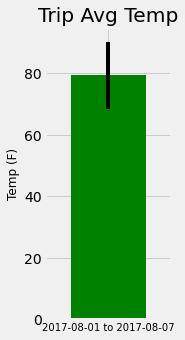
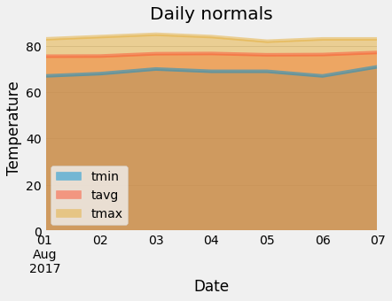

# Surfs Up!

## Climate exploratory analysis

I've decided to treat myself to a long holiday vacation in Honolulu, Hawaii! To help with the trip planning, I need to do some climate analysis on the area. 

SQLAlchemy ORM queries, Pandas, and Matplotlibcomplete was utilised for climate analysis and data exploration. For details, see [notebook](climate_exploratory_analysis.ipynb)
</br>
### Precipication bar chart:</br>


### Station histogram:</br>


- - -

## Develop a Climate App

I designed a Flask API based on the developed queries

<table>
  <tr>
    Home page: </br>
    
  </tr>
  <tr>
    <td>Display all precipitation:</br>
      
    </td>
    <td>Display all stations:</br>
      
    </td>
  </tr>
  <tr>
    <td>Temperature observations of
the most active station one year ago:</br>
      
    </td>
    <td>Find the min,max,average temperature
given the start date and end date:</br>
      
    </td>
  </tr>

</table>

- - -

## Other Analyses

### Temperature Analysis I

Unpaired or independent t-test was used to conclude the difference between the means of temperature in June and the means of temperature in December is statistically significant.

### Temperature Analysis II

* I am looking to take a trip from August first to August seventh of this year, but worried that the weather will be less than ideal. Using historical data in the dataset, I found out what the temperature has previously looked like.
* I plotted the min, avg, and max temperature.
Note: y error bar (YERR) is the peak-to-peak (TMAX-TMIN) value:</br>



### Daily Rainfall Average

A query to see what the rainfall has been, no vacation when it rains the whole time!
```
session.query(*sel).
  filter(Measurement.date >= start_date).
  filter(Measurement.date <= end_date).
  filter(Measurement.prcp >= 0).
  filter(Measurement.station == Station.station).
  group_by(Measurement.station).
  order_by(total_prcp.desc()).all()
```


### Daily Temperature Normals

The daily normals was calculated for the duration of my trip. Normals are the averages for the min, avg, and max temperatures for daily data from the last 3 years.

  

